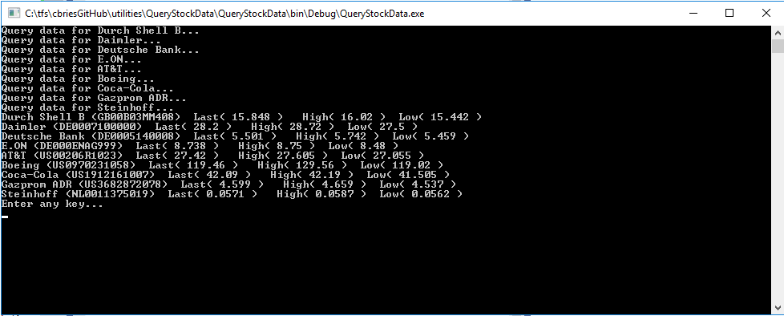

## How to call?

Provide a file named "StockList.json" side-by-side of the application, OR provide a file path as first argument, e.g. `QueryStockData.exe {path to file}`.

## Output

The output will look like:

Inline-style: 

